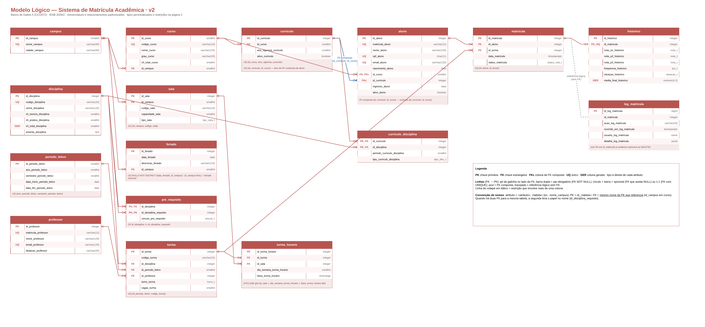
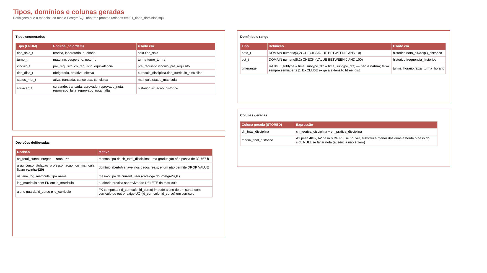

# Projeto Acadêmico BD2 2026.2 — Sistema de Matrícula Acadêmica

Banco de Dados II (CCO072) — Centro Universitário IESB — 2026/2 — Prof. Rodrigo Gonçalves

Autores: ver [AUTORES.md](AUTORES.md).

## Antes do Código
Após feedback do professor em 24 de agosto sobre a importância de seguir as etapas iniciais de desenvolvimento, a equipe priorizou a modelagem do banco de dados. Utilizando a ferramenta Draw.io, revisamos a estrutura e corrigimos erros presentes no modelo lógico inicial da disciplina. Os diagramas dos modelos conceitual e lógico resultantes estão disponíveis abaixo.

### Modelo lógico

Modelo lógico v2 do sistema (16 tabelas). O DDL em `sql/01` a `sql/03` segue exatamente os nomes deste diagrama.

[](modelo_logico.pdf)

Convenção de nomes: atributo = `<atributo>_<tabela>` (ex.: `nome_campus`), PK = `id_<tabela>`, FK = mesmo nome da PK que referencia. Quando há duas FK para a mesma tabela, a segunda leva o papel no nome (`id_disciplina_requisito`).

Tipos enumerados, domínios, `timerange` e colunas geradas (página 2 do PDF):



PDF completo: [modelo_logico.pdf](modelo_logico.pdf)

## Pré-requisito

Docker (Desktop ou Engine). Nenhuma outra dependência — PostgreSQL 17 e pgAdmin rodam em contêiner.

## Subindo o ambiente do zero

```bash
docker compose up -d
```

Isso levanta:

| Serviço | Endereço | Credenciais |
|---|---|---|
| PostgreSQL 17 | `localhost:5432` | usuário `bd2` · senha `bd2` · base `matricula` |
| pgAdmin | http://localhost:8080 | login `admin@iesb.br` · senha `admin` |

A base `matricula` sobe **vazia**. O esquema é criado pelos scripts em `sql/`.

## Rodando os scripts SQL

Os arquivos em `sql/` são numerados na ordem real de execução. Rodar `01` → `07` num banco vazio precisa levantar o esquema funcionando (Marco 1):

```bash
for f in sql/0{1,2,3,4,5,7}_*.sql; do
  docker compose exec -T postgres psql -U bd2 -d matricula -v ON_ERROR_STOP=1 -f - < "$f"
done
```

`06`, `08`, `09`, `10` compõem o Marco 2 e são rodados depois, na mesma ordem numérica.

## Recomeçando do zero

```bash
docker compose down -v   # apaga os dados
docker compose up -d     # sobe limpo de novo
# rodar os scripts sql/ novamente
```

## Estrutura do repositório

```
docker-compose.yml        # ambiente Docker (PostgreSQL 17 + pgAdmin)
sql/                       # scripts SQL numerados na ordem de execução
scripts/                   # ferramental de teste, verificação e automação
docs/                      # imagens do modelo lógico usadas no README
modelo_logico.pdf          # modelo lógico v2 (diagrama + tipos/domínios)
evidencias/explain.md      # EXPLAIN (ANALYZE, BUFFERS) antes/depois dos índices
AUTORES.md                 # integrantes e frente de cada um
```

## Frentes do grupo

Cada integrante tem uma responsabilidade técnica formal (ver Seção 3 do enunciado) e é avaliado individualmente na arguição cruzada sobre a frente de **outro** colega — ver [AUTORES.md](AUTORES.md).

## Marcos

| Marco | Conteúdo | Data |
|---|---|---|
| Marco 1 | DDL completo, carga (≥100 alunos, ≥6 turmas, ≥300 matrículas), 10 consultas | 14/09/2026 |
| Marco 2 | views, índices, transações, segurança/RLS, backup/restauração | 06/11/2026 |
